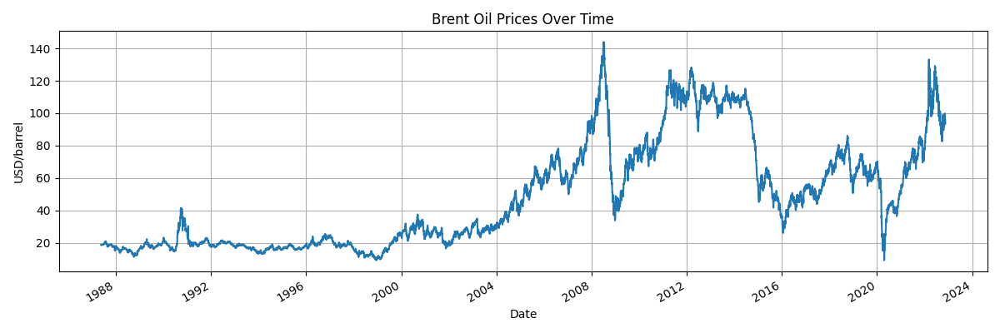
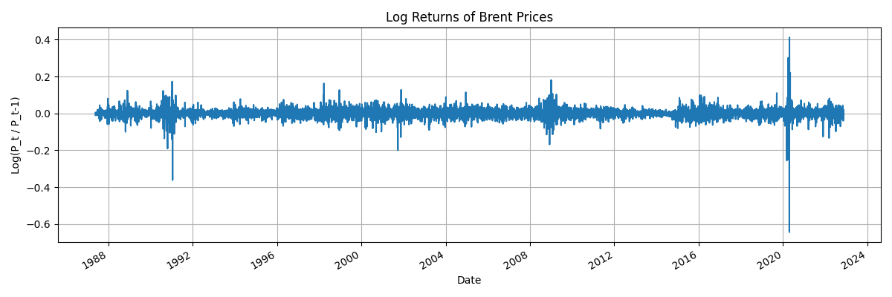
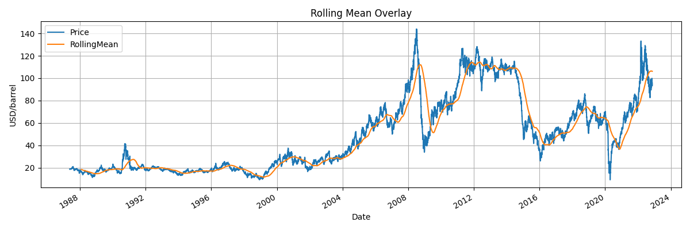

# Change Point Analysis and Statistical Modelling of Time Series Data


[](https://github.com/nuhaminae/Change-Point-Analysis-and-Statistical-Modelling-of-Time-Series-Data/actions/workflows/CI.yml)

## Overview

In this project, we explore how PyMC4-powered change point modelling transforms Brent oil price volatility into structured market intelligence. We provide stakeholders, investors, policymakers, and energy firms with actionable insights by detecting statistically significant regime shifts and correlating them with geopolitical and economic events. In addition we integrate curated tabular event data, probabilistic modelling, and visual storytelling, our approach combines analytical rigour with an interactive dashboard to help navigate global energy disruptions with clarity and confidence.

---

## Key Features

- **Bayesian Change Point Modelling with PyMC4** Implements regime detection using switch functions and posterior distributions to identify structural shifts in oil price behaviour.
- **Log Return Analysis and Stationarity Diagnostics** Tracks volatility clustering and rolling metrics with ADF/KPSS tests to support regime segmentation.
- **Event Attribution Engine** Cross-references tabular event metadata with detected change points to assess potential geopolitical and economic causes.
- **Interactive Dashboard** Built with Flask (API backend) and React (frontend), enabling users to explore regime segments, event overlays, and volatility metrics.
- **Pre-commit Tooling for Code Quality** Integrates Black, isort, flake8, and nbQA to ensure clean formatting and linting of notebooks and scripts.
- **Data Versioning and CI Integration** Uses DVC and GitHub Actions for reproducible workflow and continuous integration checks.

---

## Table of Contents

- [Project Background](#project-background)
- [Data Sources](#data-sources)
- [Project Structure](#project-structure)
- [Installation](#installation)
- [Usage](#usage)
- [Contribution](#contribution)
- [Next Steps](#next-steps)
- [Project Status](#project-status)

---

## Project Background

The global oil market is a narrative of disruption where geopolitical shocks, OPEC decisions, and policy turns leave fingerprints on price charts. At Birhan Energies, we transform this turbulence into clarity. We use Bayesian Change Point Modelling via PyMC4, and analyse Brent oil prices to uncover “when” structural shifts occur and “why” they might be happening.

### **Business Need**

With Brent oil serving as a strategic signal across economic and political domains, stakeholders require more than intuition—they need data-backed interpretation. Our aim is to:

- Identify statistically robust breaks in price behaviour.
- Cross-reference these with documented geopolitical and economic events.
- Deliver insights through an interactive dashboard that contextualises shifts.

---

## Data Sources

- **Brent Prices**: Daily USD/barrel from May 1987 to September 2022.
- **Event Tabdata**: 20 curated entries covering economic shocks, OPEC decisions, geopolitical conflicts.

---

## Project Structure

```bash
├── .dvc/                              # Data Version Control
├── .github/                           # CI workflows
├── data/
│   ├── raw/                           # Original datasets
│   └── processed/                     # Cleaned and transformed datasets
├── insights/                          # Plots and charts for reporting
├── notebooks/                         # Notebooks
│   ├── 01_eda.ipynb
|   └── ...
├── scripts/                           # Core scripts
│   ├── __init__.py
|   ├── _01_eda.py
|   └── ...
├── tests/
│   ├── test_dummy.py
|   ├── test_01_eda.py
|   └── ...
├── .dvcignore
├── .flake8
├── .gitignore                         # Ignore unnecessary files
├── .pre-commit-config.yaml            # Pre-commit configuration
├── format.ps1                         # Formatting
├── pyproject.toml
├── README.md                          # Project overview and setup instructions
└── requirements.txt                   # Pip install fallback
```

---

## Installation

### Prerequisites

- Python 3.8 or newer (Python 3.12 recommended)
- `pip` (Python package manager)
- [DVC](https://dvc.org/) (for data version control)
- [Git](https://git-scm.com/)

### Setup

```bash
# Clone repo
git clone https://github.com/nuhaminae/Change-Point-Analysis-and-Statistical-Modelling-of-Time-Series-Data
cd https://github.com/nuhaminae/Change-Point-Analysis-and-Statistical-Modelling-of-Time-Series-Data
____________________________________________
# Create and activate virtual environment
python -m venv .oilvenv
.oilvenv\Scripts\activate      # On Windows
source .oilvenv/bin/activate   # On Unix/macOS
____________________________________________
# Install dependencies
pip install -r requirements.txt
____________________________________________
# Install and activate pre-commit hooks
pip install pre-commit
pre-commit install
____________________________________________
# (Optional) Pull DVC data
dvc pull
```

---

## Usage

Once the environment is set up, you can execute the pipeline and inspect model outputs as follows:

1. Preprocessing and EDA

Run the core preprocessing scripts:

```bash
python scripts/_eda.py.py
```

The script performs initial diagnostics on the Brent oil price series as a foundation for Bayesian change point Modelling.

This script generate the following visualisation:

- `insights/eda/brent_oil_prices_over_time.png`
- `insights/eda/log_returns_of_brent_prices.png`
- `insights/eda/rolling_mean_overlay.png`
- `insights/eda/rolling_volatility_(std_dev).png`

### Explore with Notebooks

Notebooks are provided for exploratory and iterative development:

- `notebooks/01_eda.ipynb` — visual patterns in data

Open with Jupyter or VSCode to navigate the workflow interactively.

### Code Quality

This project uses pre-commit hooks to automatically format and lint `.py` and `.ipynb` files using:

|Tool       | Purpose                                       |
|:----------|-----------------------------------------------|
| Black    |Enforces consistent code formatting            |
| isort     |Sorts and organises import statements          |
| Flake8    |Lints Python code for style issues             |
| nbQA      |Runs Black, isort, and Flake8 inside notebooks |

``` bash
# Format and lint all scripts and notebooks
pre-commit run --all-files
```

---

## EDA Visual Insights

The following plots illustrate key trends in the Bernt Oil Price:

- Price Trend


- Log Price Return


- 180 days Rolling Mean Price



- Rolling Volatality

.png)

---

## Contribution

Contributions are welcome! Please fork the repository and submit a pull request. For major changes, open an issue first to discuss what you would like to change.
Make sure to follow best practices for version control, testing, and documentation.

---

## Next Steps

- Finalise PyMC4 model comparison notebook with multiple breakpoints and dynamic priors.
- Extend event attribution logic to highlight probable causal links with confidence annotations.
- Build Flask API routes for regime parameters, change dates, and event-tagged summaries.
- Implement dashboard features:
  - Date sliders and event filters
  - Regime overlays and tooltip explanations
  - Responsive layout and trace plot integration
- Add interactive notebooks with PyMC4 summary and ArviZ visualisations.
- Document modelling assumptions and dashboard walkthrough in a final Medium blog.

---

## Project Status

The project is underway. Follow the [commit history](https://github.com/nuhaminae/Change-Point-Analysis-and-Statistical-Modelling-of-Time-Series-Data).
