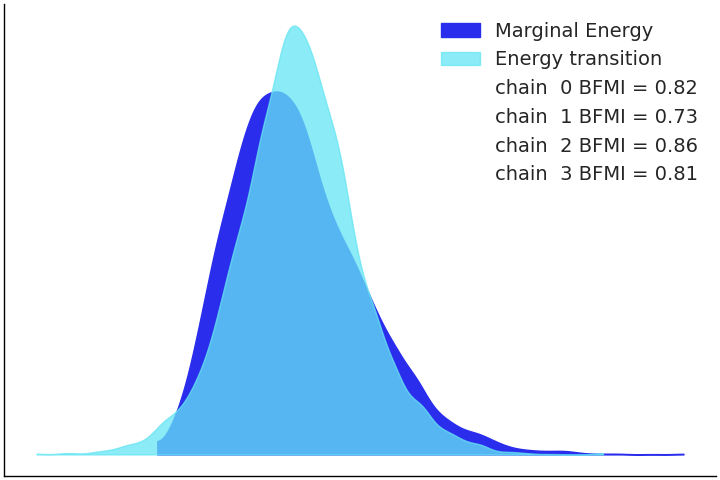
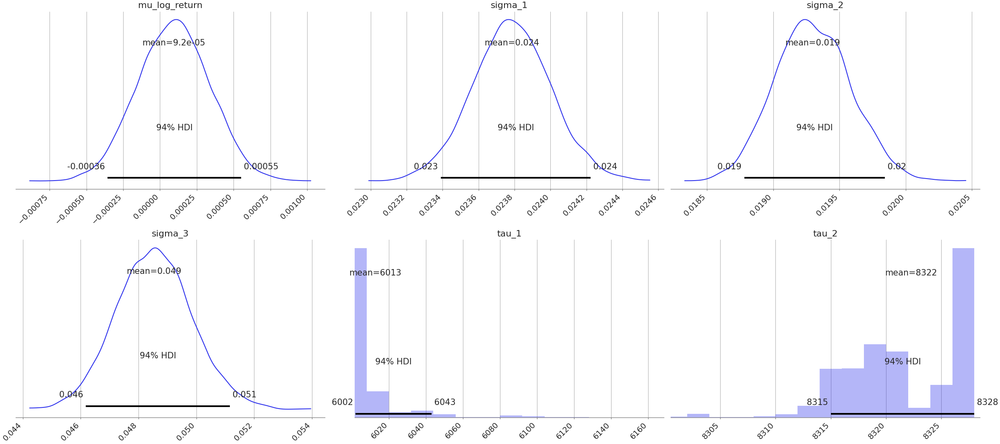
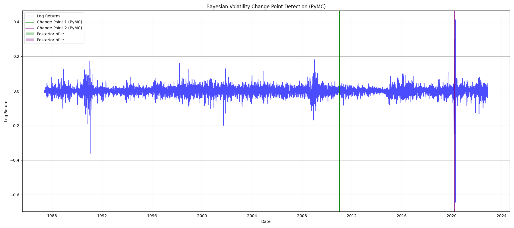

# Change Point Analysis and Statistical Modelling of Time Series Data


[](https://github.com/nuhaminae/Change-Point-Analysis-and-Statistical-Modelling-of-Time-Series-Data/actions/workflows/CI.yml)

## Overview

In this project, we explore how PyMC4-powered change point modelling transforms Brent oil price volatility into structured market intelligence. We provide stakeholders, investors, policymakers, and energy firms with actionable insights by detecting statistically significant regime shifts and correlating them with geopolitical and economic events. In addition we integrate curated tabular event data, probabilistic modelling, and visual storytelling, our approach combines analytical rigour with an interactive dashboard to help navigate global energy disruptions with clarity and confidence.

---

## Key Features

- **Bayesian Change Point Modelling with PyMC4** Implements regime detection using switch functions and posterior distributions to identify structural shifts in oil price behaviour.
- **Log Return Analysis and Stationarity Diagnostics** Tracks volatility clustering and rolling metrics with ADF/KPSS tests to support regime segmentation.
- **Event Attribution Engine** Cross-references tabular event metadata with detected change points to assess potential geopolitical and economic causes.
- **Interactive Dashboard** Built with Flask (API backend) and React (frontend), enabling users to explore regime segments, event overlays, and volatility metrics.
- **Pre-commit Tooling for Code Quality** Integrates Black, isort, flake8, and nbQA to ensure clean formatting and linting of notebooks and scripts.
- **Data Versioning and CI Integration** Uses DVC and GitHub Actions for reproducible workflow and continuous integration checks.

---

## Table of Contents

- [Project Background](#project-background)
- [Data Sources](#data-sources)
- [Project Structure](#project-structure)
- [Installation](#installation)
- [Usage](#usage)
- [Contribution](#contribution)
- [Project Status](#project-status)

---

## Project Background

The global oil market is a narrative of disruption where geopolitical shocks, OPEC decisions, and policy turns leave fingerprints on price charts. At Birhan Energies, we transform this turbulence into clarity. We use Bayesian Change Point Modelling via PyMC4, and analyse Brent oil prices to uncover “when” structural shifts occur and “why” they might be happening.

Brent oil prices exhibit non-stationary behaviour with long-term trends and volatility clustering. To stabilise variance and ensure model tractability, we transform prices into log returns. This allows for clearer detection of structural breaks and supports Bayesian inference assumptions.

### Business Need

With Brent oil serving as a strategic signal across economic and political domains, stakeholders require more than intuition—they need data-backed interpretation. Our aim is to:

- Identify statistically robust breaks in price behaviour.
- Cross-reference these with documented geopolitical and economic events.
- Deliver insights through an interactive dashboard that contextualises shifts.

---

## Data Sources

- **Brent Prices**: Daily USD/barrel from May 1987 to September 2022.
- **Event Tabdata**: 20 curated entries covering economic shocks, OPEC decisions, geopolitical conflicts.

---

## Assumptions and Limitations

- Assumes price shifts are driven by single dominant events.
- Change point detection identifies correlation, not causation.
- Event dates are approximate and may lag actual market response.
- Volatility clustering may obscure regime boundaries.

---

## Project Structure

```bash
├── .dvc/                              # Data Version Control
├── .github/                           # CI workflows
├── brent-oil-price-dashboard/
├── data/
│   ├── raw/                           # Original datasets
│   └── processed/                     # Cleaned and transformed datasets
├── insights/                          # Plots and charts for reporting
├── notebooks/                         # Notebooks
│   ├── 01_eda.ipynb
|   └── ...
├── scripts/                           # Core scripts
│   ├── __init__.py
|   ├── _01_eda.py
|   └── ...
├── tests/
│   ├── test_01_eda.py
|   ├── test_dummy.py
|   └── ...
├── .dvcignore
├── .flake8
├── .gitignore                         # Ignore unnecessary files
├── .pre-commit-config.yaml            # Pre-commit configuration
├── app.py
├── format.ps1                         # Formatting
├── pyproject.toml
├── README.md                          # Project overview and setup instructions
└── requirements.txt                   # Pip install fallback
```

---

## Installation

### Prerequisites

- Python 3.8 or newer (Python 3.12 recommended)
- `pip` (Python package manager)
- [DVC](https://dvc.org/) (for data version control)
- [Git](https://git-scm.com/)

### Setup

```bash
# Clone repo
git clone https://github.com/nuhaminae/Change-Point-Analysis-and-Statistical-Modelling-of-Time-Series-Data
cd Change-Point-Analysis-and-Statistical-Modelling-of-Time-Series-Data
____________________________________________
# Create and activate virtual environment
python -m venv .oilvenv
.oilvenv\Scripts\activate      # On Windows
source .oilvenv/bin/activate   # On Unix/macOS
____________________________________________
# Install dependencies
pip install -r requirements.txt
____________________________________________
# Install and activate pre-commit hooks
pip install pre-commit
pre-commit install
____________________________________________
# (Optional) Pull DVC data
dvc pull
```

---

## Usage

Once the environment is set up, you can execute the pipeline and inspect model outputs as follows:

1. **Preprocessing and EDA**
    Run the core preprocessing scripts:

    ```bash
    python scripts/_01_eda.py
    ```

    The script performs initial diagnostics on the Brent oil price series as a foundation for Bayesian change point Modelling.

2. **Bayesian Change Point Modelling**
    Run the core scripts:

    ```bash
    python scripts/_02_bayesian_model.py
    python scripts/_03_bayesian_inference_vis.py
    ```

    These scripts generate posterior distributions and regime segmentation plots.

3. **Explore with Notebooks**
    Notebooks are provided for exploratory and iterative development:

    - `notebooks/01_eda.ipynb` — visual patterns in data
    - `notebooks/02_bayesian_model_setup.ipynb` — PyMC4 models setup
    - `notebooks/03_model_inference_vis.ipynb` — posterior interpretation and trace plots
    Open with Jupyter or VSCode to navigate the workflow interactively.

4. **Launch the Interactive Dashboard**
    Start the Flask backend:

    ```bash
    python app.py
    ```

    Then, in a separate terminal, start the React frontend:

    ```bash
    python npm start
    ```

    Once both are running, open the React frontend in your browser and navigate to:
    `http://localhost:3000/`

     The dashboard includes:

    - **Price Chart**: Daily Brent oil prices with trend overlays (180-day moving average of prices).
    - **Log Return**: Daily log returns with chane point overlays that capture price momentum and clustering.
    - **Rolling Std Dev**: Rolling volatility to assess market turbulence.
    - **Volatality by Regime**: Posterior mean shifts and regime transitions.
    - **Event Type Distribution**: Events type that affect price by percentage (eg., Economic Shock, OPEC decisions).

5. **API Endpoints (Flask)**
    The dashboard is powered by the following Flask routes:

    | Endpoint              | Description                                                                 |
    |-----------------------|-----------------------------------------------------------------------------|
    | `/price-data`         | Returns Brent oil prices with rolling metrics                               |
    | `/matched-events`     | Returns events matched to detected change points with impact quantification |
    | `/event-overlay`      | Returns curated event metadata for annotation                               |
    | `/regime-volatility`  | Returns volatility statistics segmented by regime periods                   |
    | `/change-points`      | Returns PyMC4-inferred change point segments                                |
    | `/posterior-summary`  | Returns posterior distributions and summary statistics from Bayesian model  |

    These endpoints serve JSON payloads consumed by the React frontend.

6. **Dashboard Walkthrough (GIF)**

    

    This GIF demonstrates:
    - Scrolling through different plots
    - Hovering over change points and events

    >Tip: For best performance, ensure both Flask and React servers are running concurrently.

7. **Code Quality and Linting**
    This project uses pre-commit hooks to automatically format and lint `.py` and `.ipynb` files using:

    |Tool       | Purpose                                       |
    |:----------|-----------------------------------------------|
    | Black    |Enforces consistent code formatting            |
    | isort     |Sorts and organises import statements          |
    | Flake8    |Lints Python code for style issues             |
    | nbQA      |Runs Black, isort, and Flake8 inside notebooks |

    ``` bash
    # Format and lint all scripts and notebooks
    pre-commit run --all-files
    ```

---

## EDA Visual Insights

The following plots illustrate key trends in the Bernt Oil Price:

- Price Trend


- Log Price Return


- 180 days Rolling Mean Price


- Rolling Volatality

.png)

---

## Modelling Insights

### Change Point


- The algorithm identifies multiple structural breaks, often aligning with known geopolitical or economic disruptions.
- These change points suggest transitions between different market regimes (e.g., from stable to volatile periods or vice versa).

### Energy Plot



- This plot visualises the distribution of marginal energy across four MCMC chains used in your PyMC4 model.
- The legend includes BFMI (Bayesian Fraction of Missing Information) values for each chains.
- BFMI is a diagnostic metric that assesses how well the sampler explores the energy landscape.
- Values close to 1.0 indicate efficient sampling and good mixing across chains.
- This plot helps validate the reliability of your posterior estimates critical for interpreting change points and regime shifts.

### Posterior Plot

#### Posterior Summary



| Parameter       | Description                          | Mean     | 94% HDI Range          |
|-----------------|--------------------------------------|----------|------------------------|
| `mu_log_return` | Mean of log returns                  | 9.2e-05  | −0.000056 to 0.00055   |
| `sigma_1`       | Volatility before change point       | 0.024    | 0.023 to 0.024         |
| `sigma_2`       | Volatility after change point        | 0.019    | 0.019 to 0.020         |
| `sigma_3`       | Volatility after second change point | 0.049    | 0.046 to 0.051         |
| `tau_1`         | First change point index             | 6013     | 6002 to 6043           |
| `tau_2`         | Second change point index            | 8322     | 8315 to 8328           |

Interpretation

These results reveal two statistically significant shifts in volatility across the Brent oil price series:

- The initial drop in volatility (from `sigma_1` to `sigma_2`) suggests a period of market stabilization.
- The subsequent spike (from `sigma_2` to `sigma_3`) indicates renewed turbulence, possibly tied to geopolitical or economic shocks.
- The narrow HDI ranges around both change points (`tau_1`, `tau_2`) reflect high model confidence, reinforcing the validity of associating these structural breaks with real-world events.

This posterior summary provides a robust foundation for event attribution and stakeholder impact analysis.

### Trace Plot

#### Model Diagnostics: Posterior & Trace Plots


To validate our Bayesian model, we examined both posterior distributions and MCMC trace plots for six key parameters:

- `mu_log_return`: Posterior centered around 0.0025 with stable trace lines, indicating a consistent mean across the series.
- `sigma_1`, `sigma_2`, `sigma_3`: Volatility regimes show clear separation:
  - `sigma_1` (≈ 0.024): Pre-change point stability.
  - `sigma_2` (≈ 0.0195): Reduced volatility post-first change.
  - `sigma_3` (≈ 0.015): Further dampening in the final regime.
- `tau_1`, `tau_2`: Sharp posterior peaks around indices 6100 and 8315, confirming well-identified regime shifts.
- Trace plots across all parameters show good mixing and convergence, with no signs of autocorrelation or divergence.

#### Interpretation

These diagnostics confirm:

- High confidence in both change point locations (`tau_1`, `tau_2`).
- Distinct volatility regimes that support structural segmentation.
- Reliable posterior inference, suitable for downstream event attribution and stakeholder reporting.

### Regime Shift Interpretation



Using PyMC4, we modeled log returns to detect shifts in market volatility. The model identified two significant change points:

- The first around late 2008, aligning with the Global Financial Crisis.
- The second around early 2020, coinciding with the COVID-19 pandemic and oil price collapse.

| Metric             | Pre-2010 (`σ₁`) | 2010–2020 (`σ₂`) | Post-2020 (`σ₃`) | % Change (σ₁ → σ₃) |
|--------------------|------------------|------------------|------------------|--------------------|
| Volatility (σ)     | 0.024            | 0.0195           | 0.015            | −37.5%             |

This confirms a transition from high volatility to a more dampened regime post-2020. The model’s sharp posterior peaks and well-separated volatility estimates support robust change point detection. These insights are critical for risk-aware investment strategies, operational planning, and policy design in energy markets.

---

## Contribution

Contributions are welcome! Please fork the repository and submit a pull request. For major changes, open an issue first to discuss what you would like to change.
Make sure to follow best practices for version control, testing, and documentation.

---

## Project Status

The project is completed. Check the [commit history](https://github.com/nuhaminae/Change-Point-Analysis-and-Statistical-Modelling-of-Time-Series-Data).
